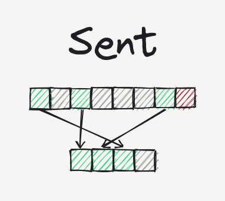

# Sent
<p align="center">
    
</p>

This is an ECS (Entity Component System) implementation written in C++ in almost one day.

Sent was only a small experiment on sparse sets and ECS implementations heavily inspired
by [this post](https://skypjack.github.io/2020-08-02-ecs-baf-part-9/) from
[EnTT](https://github.com/skypjack/entt)'s creator and (probably) should not be
used in real-world projects. But it is simple and small enough to be understood by
enthusiasts without much effort, in a short time.

## Building
Along with the ECS itself (which is header-only), this repo contains a little benchmark
tool which can be build and executed. Since it doesn't depend on any libraries except
the C++ standard library, It can be built with most C++ toolchains out there.

On a Linux box (and generally any Unix-like box with `g++`) you can build it with
(this includes optimizations):
```sh
g++ main.cpp -o a.out -O3
```

On Windows, you should be able to build it with [MinGW](https://www.mingw-w64.org/)
or the Visual Studio compiler.

## Running
Just run the resulting executable (It will be `a.out` if you used the command above)
and give it the number of entities to be created for test on the standard input
(usually your terminal). On a Unix-like shell, you can also run:
```sh
echo N | ./a.out
```
Where `N` is the number of entities for the test.
Then, it will print the time spent on creating the entities and running some
near real-life queries on them. For more details, you can look inside `main.cpp`.

---
The "cover art" is created using [Rnote](https://rnote.flxzt.net) and inspired by
an image in [Skypjack](https://github.com/skypjack)'s blog post mentioned above
and thus is distributed under
[CC BY-NC-SA 4.0](https://creativecommons.org/licenses/by-nc-sa/4.0/).